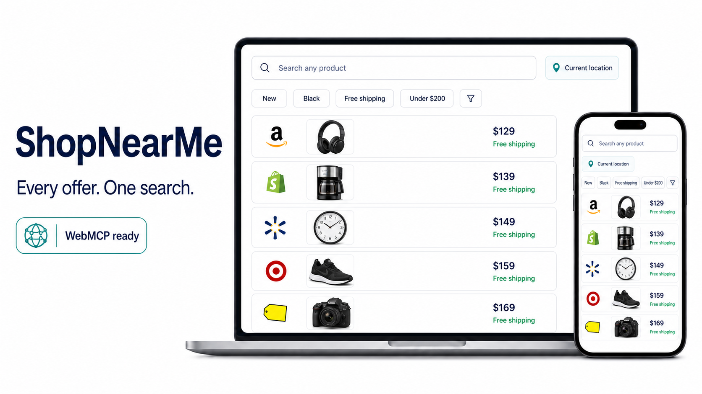

# ShopNearMe



**Live site:** [https://shopnearme-webmcp.vercel.app](https://shopnearme-webmcp.vercel.app)

ShopNearMe turns one product query into a structured comparison of offers that can be ordered, bought in a nearby store, or purchased second hand. It shows the total checkout price whenever shipping is known, exposes product-specific filters, and gives both people and browser agents the same useful workflow through WebMCP.

## Why it exists

Product search is fragmented across retailer sites, local inventory, marketplaces, and shipping rules. ShopNearMe normalizes those results into three conditional sections:

- **Order online** — delivery offers with item price, shipping, and total price.
- **Buy in store** — nearby pickup offers with distance.
- **Second hand** — used, refurbished, vintage, and resale listings.

Empty sections are never rendered. Offers with incomplete total-price data are opt-in, visually marked **Price unverified**, and sorted after verified prices.

## WebMCP

The app uses the current imperative `document.modelContext.registerTool()` API and registers five tools:

| Tool | Purpose |
| --- | --- |
| `search_products` | Search any product and optional location; returns structured offers and facets. |
| `get_visible_results` | Read the current result set. |
| `set_search_location` | Change the location used by the UI and searches. |
| `filter_results` | Apply product-specific facet filters and the unverified-price opt-in. |
| `sort_results` | Sort by total price ascending or descending. |

Read-only tools use `readOnlyHint: true`, and tools that return retailer content use `untrustedContentHint: true`. Registrations are tied to an `AbortController`, so React lifecycle changes cannot leave stale tools behind.

## Data and request efficiency

- Live order results come from SerpAPI's Google Shopping engine, nearby businesses come from its Google Maps local results using the selected coordinates, and used listings come directly from eBay's Browse API. All searches run behind one server-side endpoint, and API credentials never reach the browser.
- eBay uses a cached application OAuth token, requests used items deliverable to the detected destination country, and includes item price plus shipping in the displayed total.
- Identical searches are cached in memory for 15 minutes.
- Simultaneous identical searches share one in-flight promise.
- The deployed endpoint sends CDN cache headers (`s-maxage=900`, `stale-while-revalidate=3600`).
- Location search uses OpenStreetMap tiles and Nominatim geocoding. The picker resolves the browser's current position instead of using a placeholder city; searched or clicked coordinates persist when it is reopened.
- Typing a location sends **zero geocoding requests**. A request is made only on Enter or the explicit Search button, and repeated queries use session cache.
- Recent searches stay in local storage and drive contextual recommendations; no account is required.

## Local development

Requirements: Node.js 20+ and npm.

```bash
npm install
copy .env.example .env.local
# Add SERPAPI_API_KEY to .env.local
npm run dev
```

Open `http://127.0.0.1:4173`.

## Verification

```bash
npm run typecheck
npm test
npm run build
```

The app is responsive at desktop and phone breakpoints, keyboard-operable, and uses semantic headings, forms, labels, sections, and dialogs.

## Deploy

The repository includes a Vercel serverless endpoint at `api/search.js`, a `vercel.json` deployment config, and a GitHub Actions workflow that runs type checking, tests, and the production build. Add `SERPAPI_API_KEY` as a server-side environment variable in the deployment dashboard, then deploy normally. Never prefix it with `VITE_`.

## Gallery

The curated gallery is in [`docs/gallery`](docs/gallery) and intentionally stays below the 25-image submission limit. It includes desktop, mobile, live arbitrary-product search, dynamic product facets, priced nearby results, and the OpenStreetMap location picker.

- [Home — desktop](docs/gallery/01-home-desktop.png)
- [Home — mobile](docs/gallery/02-home-mobile.png)
- [Coffee maker search — desktop](docs/gallery/03-coffee-maker-desktop.png)
- [Coffee maker search — mobile](docs/gallery/04-coffee-maker-mobile.png)
- [Clickable location picker](docs/gallery/05-location-picker.png)
- [Clock-specific filters](docs/gallery/06-clock-dynamic-filters.png)
- [Unverified-price opt-in](docs/gallery/07-unverified-price-opt-in.png)
- [Custom sort menu — mobile](docs/gallery/08-custom-sort-mobile.png)
- [Filter drawer — mobile](docs/gallery/09-filter-drawer-mobile.png)
- [Dining table search with local prices and dynamic filters — desktop](docs/gallery/10-dining-table-desktop.png)
- [Dining table search — mobile](docs/gallery/11-dining-table-mobile.png)

## Demo video

The submission-ready demo is [`docs/demo/shopnearme-demo.mp4`](docs/demo/shopnearme-demo.mp4): 1 minute 54 seconds, 1920×1080, H.264 video, AAC English narration, and an embedded English caption track. The narration transcript and standalone `.srt` captions are included beside it.

The project thumbnail is available as both [`PNG`](docs/assets/thumbnail.png) and [`JPEG`](docs/assets/thumbnail.jpg).

## Hackathon notes

Built for The WebMCP Challenge. The project is designed to demonstrate that WebMCP can expose a genuinely useful research workflow—not merely mirror a button click—while keeping the human interface first-class.

## License

MIT
